# Arquitectura de GatoPago

GatoPago es una billetera de dólares (USDC) que se abre con una passkey, y **Flow**, una API para
que los comercios cobren en USDC. Todo corre en testnet. Los diagramas están en `diagramas/`
(fuente `.puml` e imagen `.svg`).

## Qué hace

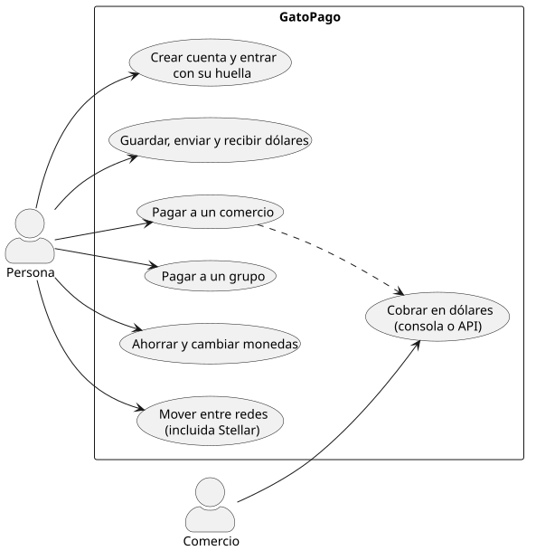

## Cómo está armado

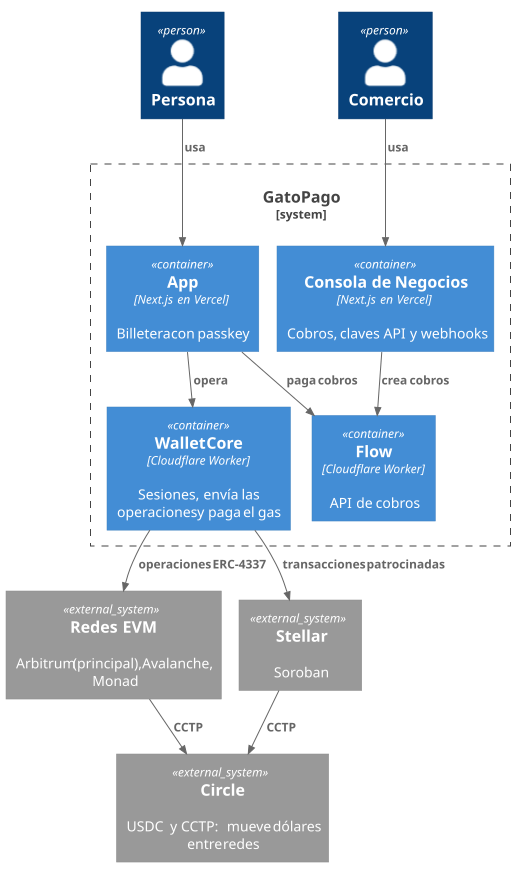

- **App y consola** (Vercel): la billetera y la consola de los comercios.
- **Wallet Core** (Cloudflare): sesiones, envía las operaciones a cada red y paga el gas.
- **Flow** (Cloudflare): crea cobros, los confirma en la red y avisa al comercio por webhook.
- **SDK `@gatopago/shared`**: las reglas del dinero (redes, CCTP, Aave, Uniswap, Stellar), usado
  por todos.
- Las bases de datos son caché: los saldos y los dueños de cada cuenta viven en la blockchain.

### Componentes de los Workers

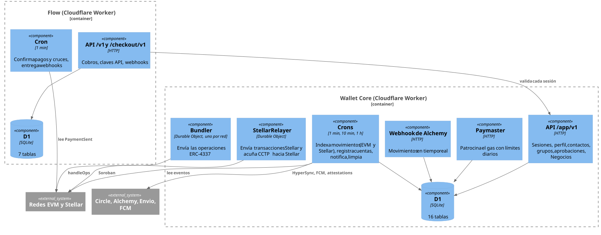

- **Bundler** (un Durable Object por red): envía las operaciones ERC-4337 al EntryPoint con la
  llave relayer, una a la vez.
- **StellarRelayer** (Durable Object): envía las transacciones de Stellar de a una con la cuenta
  patrocinadora y acuña los USDC que llegan por CCTP (pregunta a Circle cada 5 s mientras espera).
- **Crons de Wallet Core:** cada minuto registra cuentas nuevas en los webhooks y en Stellar,
  indexa Stellar y envía avisos; cada 10 minutos concilia las redes EVM (Envio HyperSync o RPC);
  cada hora limpia lo vencido.
- **Webhook de Alchemy:** los movimientos EVM llegan en tiempo real; las notificaciones salen por
  Firebase Cloud Messaging.
- **Cron de Flow** (cada minuto): confirma pagos en la red, completa cruces de CCTP y entrega
  webhooks firmados a los comercios.

### Tablas

**Wallet Core** (D1, 16 tablas):

| Para qué | Tablas |
|---|---|
| Miembros y acceso | `members`, `invites`, `siwe_nonces`, `approvals` (cambios de llaves firmados) |
| Conveniencia | `contacts`, `member_groups`, `push_tokens`, `card_interest` |
| Actividad (caché de la cadena) | `transfers`, `index_cursors` |
| Gas patrocinado | `sponsorship_usage` |
| Stellar | `stellar_keys`, `stellar_relays`, `stellar_submissions` |
| Negocios | `business_logins`, `business_keys` |

**Flow** (D1, 7 tablas): `merchants`, `api_keys` (solo el hash), `payment_intents` (los cobros),
`events`, `webhook_endpoints`, `webhook_deliveries` y `chain_cursors`.

## Mera: una passkey, varias llaves

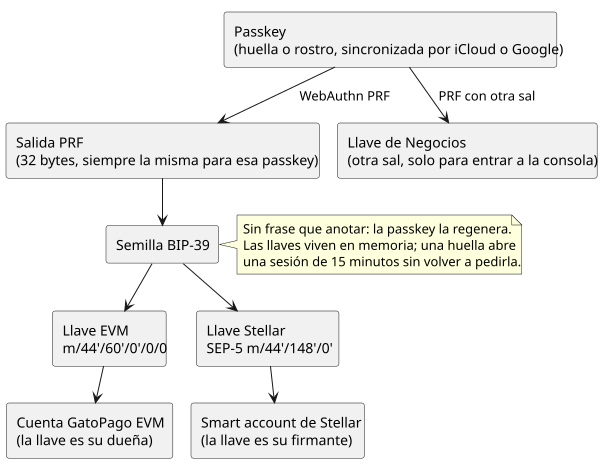

Mera (de Category Labs, el equipo de Monad) usa la extensión PRF de WebAuthn: la passkey devuelve
siempre los mismos 32 bytes secretos, y de ellos sale una semilla BIP-39 estándar.

**Qué es PRF** (*pseudo-random function*, una extensión estándar de WebAuthn): cada passkey guarda
un secreto que nunca sale del autenticador. La página le da una "sal" y, tras la huella, recibe
`HMAC(secreto, sal)`: 32 bytes. Con la misma passkey y la misma sal, el resultado es siempre el
mismo, en cualquier dispositivo donde esa passkey esté sincronizada. Con otra sal sale otro
resultado sin relación, y así separamos la billetera de Negocios. Lo soportan iCloud Keychain,
Google Password Manager, Windows Hello y las llaves físicas modernas; sin PRF no se puede crear una
cuenta.

- **Una sola huella** abre la billetera en cualquier dispositivo donde la passkey esté sincronizada.
- **Sin frase de recuperación que anotar:** la passkey regenera la semilla.
- **Llaves estándar:** EVM (BIP-44) y Stellar (SEP-5), las mismas que daría cualquier billetera con
  esa semilla. Negocios usa otra sal, así la consola nunca deriva las llaves del dinero.
- **Solo en memoria:** una huella abre una sesión de 15 minutos; al cerrar la app se borran.
- **Respaldo:** otra passkey cuya llave Mera se agrega como dueña de la misma cuenta.

## Cuentas

- **En EVM** la cuenta es una smart account ERC-4337 hecha con OpenZeppelin, con la **misma
  dirección en Arbitrum, Avalanche y Monad**. Su dueña es la llave Mera (firma de 20 bytes,
  ERC-7913). Recibe antes de existir y se crea con su primera operación.
- **En Stellar** la cuenta es una smart account de OpenZeppelin `stellar-contracts`, cuyo firmante
  es la llave Ed25519 de Mera. Su dirección sale de la cuenta EVM: también recibe antes de existir.
- GatoPago paga el gas en todas las redes. Agregar una llave de respaldo se firma una vez y vale en
  todas.

## Login

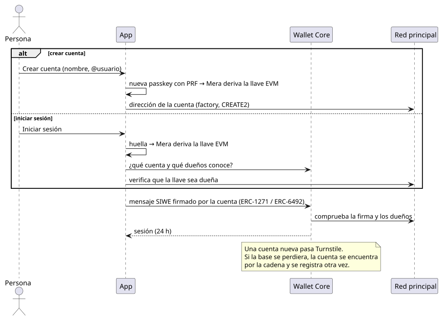

La sesión dura 24 horas y sirve para leer. Mover dinero siempre exige una firma de la llave Mera.

## Pagos

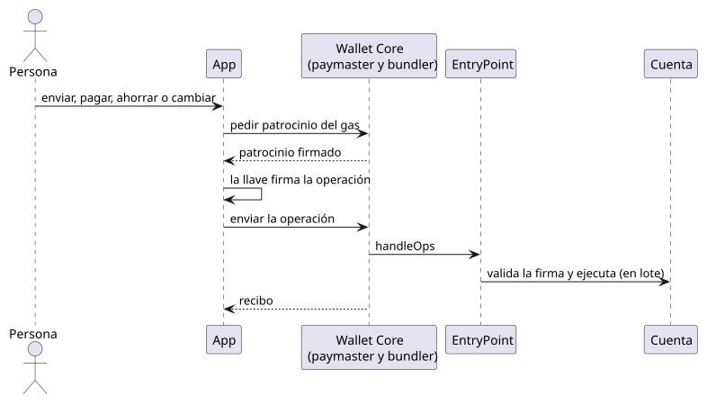

Toda acción (enviar, pagar, ahorrar, cambiar) es **una operación firmada con la passkey**, que puede
hacer varias cosas a la vez de forma atómica: por ejemplo repartir un cobro entre el equipo y
el ahorro.

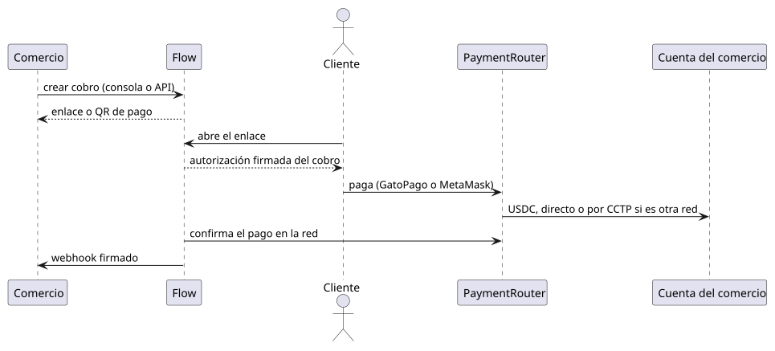

El comercio recibe en su red principal. Si el cliente paga desde otra red, el `PaymentRouter` mueve
el pago con CCTP de Circle.

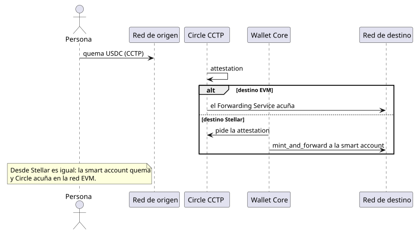

## Actividad y notificaciones

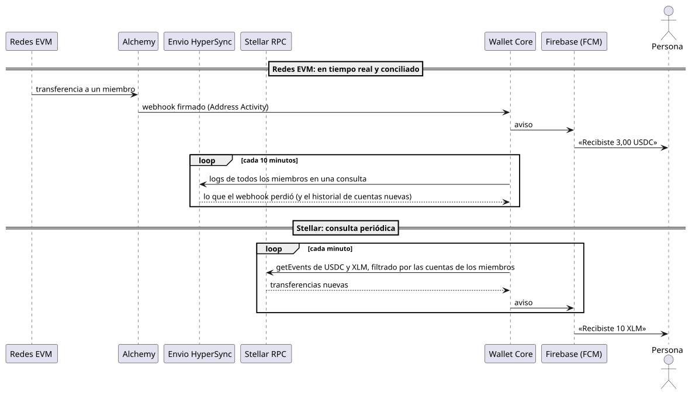

| | Redes EVM | Stellar |
|---|---|---|
| En tiempo real | Webhook de Alchemy (Address Activity) | — |
| Respaldo e historial | Envio HyperSync cada 10 minutos (RPC si falla) | — |
| Cómo lo leemos hoy | Webhook + conciliación | `getEvents` del RPC de Stellar cada minuto, filtrado por las cuentas de los miembros |

Envio no indexa Stellar: solo redes EVM y Fuel. Alchemy sí lanzó un webhook de actividad para
Stellar, con testnet y eventos de Soroban. Su documentación habla de direcciones `G…`; falta probar
si sirve para nuestras smart accounts `C…`. Si sirve, reemplazaría la consulta de cada minuto.

## Por blockchain

### Redes EVM

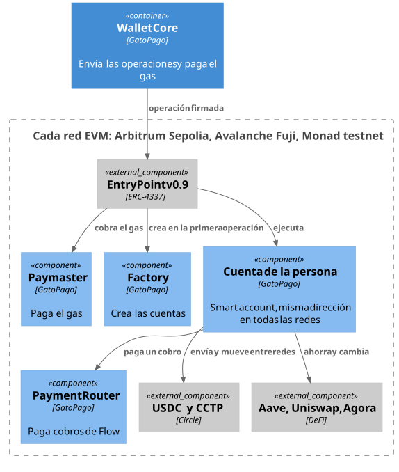

Nuestros contratos, **la misma dirección en las tres redes** (CREATE2, verificados en Sourcify):

| Contrato | Dirección |
|---|---|
| Factory de cuentas | `0x4A000246131C2DEd46ff6eA047808E708Fa0da02` |
| Cuenta (implementación) | `0xB3D5b3612163f29Ba02CDa566196BAc392B4Ff7D` |
| Paymaster | `0x9EEE399a75C2C06b528E50f05fA6d61aAcE813b1` |
| Verificador WebAuthn (código de OpenZeppelin, desplegado por nosotros) | `0x3BF33A59064bB8f9006bfF94A20Cc8917D7876E8` |

Por red:

| | Arbitrum Sepolia (principal) | Avalanche Fuji | Monad testnet |
|---|---|---|---|
| Chain id | 421614 | 43113 | 10143 |
| **PaymentRouter (nuestro)** | `0x1536b89c24b4c5296Ea67d3a5d0BFB7a3dc1c792` | `0x52a0a15d762eB68092b5B45D958C4244233b7F58` | `0x18F716B0CCAe35471986b65b8a8A15594Ab5BE40` |
| USDC (Circle) | `0x75faf114eafb1BDbe2F0316DF893fd58CE46AA4d` | `0x5425890298aed601595a70AB815c96711a31Bc65` | `0x534b2f3A21130d7a60830c2Df862319e593943A3` |
| CCTP V2 (Circle), dominio | 3 | 1 | 15 |
| Además | Aave V3 (ahorro), Uniswap v3 (cambio) | Aave V3 (ahorro) | AUSD y Agora Instant Settlement |
| Explorador | sepolia.arbiscan.io | testnet.snowtrace.io | testnet.monadexplorer.com |

Comunes de terceros: EntryPoint v0.9 `0x433709009B8330FDa32311DF1C2AFA402eD8D009` y CCTP
TokenMessengerV2 `0x8FE6B999Dc680CcFDD5Bf7EB0974218be2542DAA`.

### Stellar

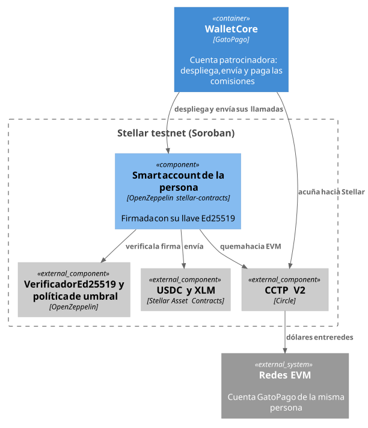

En Stellar **no desplegamos contratos propios**: usamos los auditados de OpenZeppelin y de Circle,
que **ya están desplegados en testnet** por sus equipos (lo comprobamos en la red: el WASM está
subido y los verificadores y la política responden). Lo nuestro es la cuenta patrocinadora y las
smart accounts que crea desde ese WASM, una por persona.

| | Dirección |
|---|---|
| **Cuenta patrocinadora de GatoPago** (crea las cuentas y paga las comisiones) | `GBG4Q3UYPLS6G6FE7QYKDNVSP3SYJJ3HLZASA7VQOYALYZUMGBWZXDV6` |
| **Ejemplo de smart account desplegada** | `CAN5ER6Z3SDQB5PTELJYTXIJC4C5XYMPLZLGRUCZIDIYRWKVKONQJM6D` |
| WASM de la smart account (OpenZeppelin) | hash `1b5f4534a76322da2ad7c745f6900857a6802b0ca79850c35a03561df997785a` |
| Verificador Ed25519 (OpenZeppelin) | `CAAVTMCBXEIBPR64EAASKFXERVPYFZA2JYP5A3BG6PESWEFUJX5IHKN4` |
| Política de umbral (OpenZeppelin) | `CB3FATQKCIRIQOCYRUPCQ2KREQ7T4RPKS7EAEOZWPEPUKWEDRVROBCEG` |
| USDC (Circle) | `CBIELTK6YBZJU5UP2WWQEUCYKLPU6AUNZ2BQ4WWFEIE3USCIHMXQDAMA` |
| XLM | `CDLZFC3SYJYDZT7K67VZ75HPJVIEUVNIXF47ZG2FB2RMQQVU2HHGCYSC` |
| CCTP V2 (Circle), dominio 27 | TokenMessengerMinter `CDNG7HXAPBWICI2E3AUBP3YZWZELJLYSB6F5CC7WLDTLTHVM74SLRTHP`, CctpForwarder `CA66Q2WFBND6V4UEB7RD4SAXSVIWMD6RA4X3U32ELVFGXV5PJK4T4VSZ` |
| Explorador | stellar.expert/explorer/testnet |

- **Hacia Stellar**, Circle no acuña sola: Wallet Core trae la attestation y llama a
  `mint_and_forward`, que deposita en la smart account.
- **Desde Stellar**, la smart account quema y Circle acuña en la red EVM.
- La persona no necesita XLM: GatoPago paga todas las comisiones.

#### Cómo se patrocina el gas en Stellar

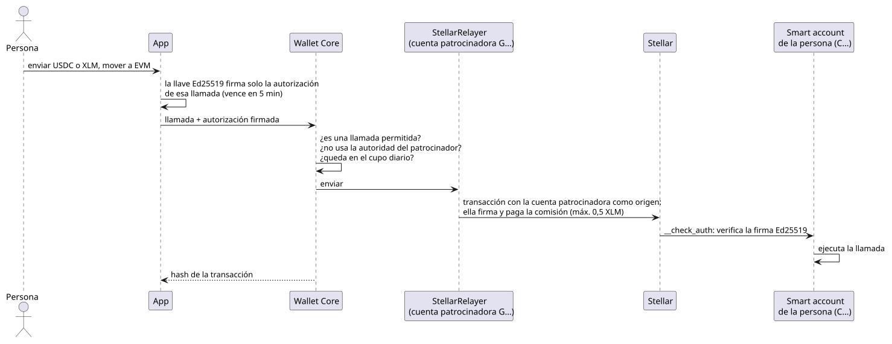

En Soroban, quien paga la comisión es la cuenta *origen* de la transacción, y la autorización de
la smart account va aparte. Por eso:

- **La persona** firma, con su llave Ed25519, solo la autorización de su llamada. Esa firma vence en
  5 minutos.
- **La cuenta patrocinadora** de GatoPago es el origen: firma la transacción y paga la comisión,
  hasta 0,5 XLM por transacción. Las transacciones salen de a una, para no chocar en su número de
  secuencia.
- **Wallet Core solo patrocina llamadas permitidas:** transferir USDC o XLM desde la cuenta de la
  persona, aprobar y quemar USDC hacia EVM con CCTP, y agregar o quitar firmantes. Rechaza toda
  autorización que intente usar la autoridad del patrocinador.
- **Cupo:** el mismo límite diario de operaciones patrocinadas que en EVM (50 por cuenta).
- **También patrocina** el despliegue de cada smart account y el `mint_and_forward` de CCTP hacia
  Stellar.

En EVM es el mismo resultado con otro mecanismo: un paymaster ERC-4337 paga el gas desde su
depósito en el EntryPoint.
